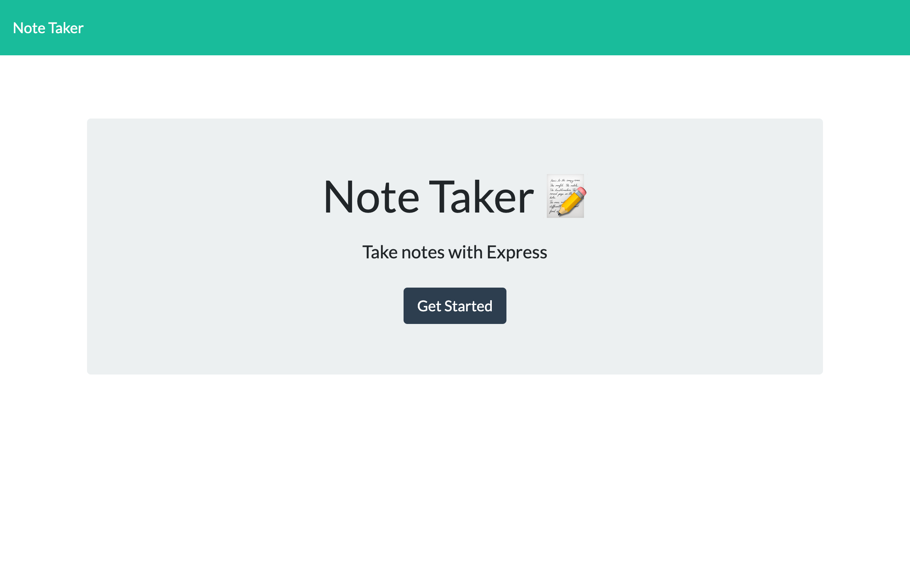
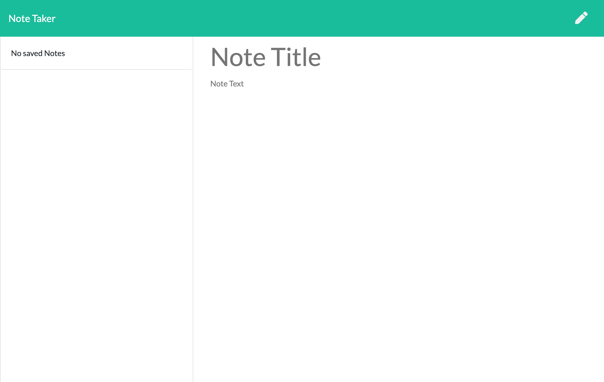
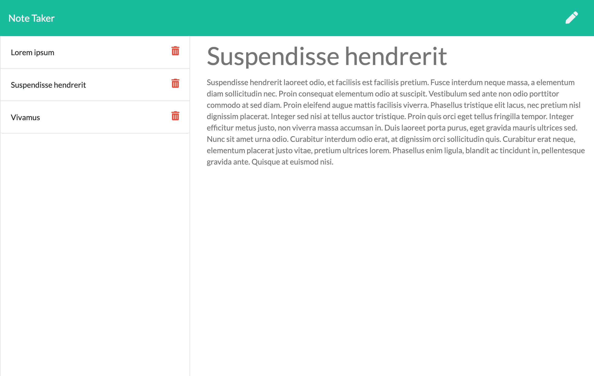

# Note Taker

## Description

This application allows users to create and save notes to keep track of information. Links to saved notes are displayed alongside the notepad which, when clicked, renders the corresponding content to the notepad as read-only. Users can also choose to delete notes when they are no longer needed.

## Table of Contents

- [Views](#views)
- [Technologies](#technologies)
- [Tests](#tests)
- [Questions](#questions)
- [License](#license)

## Views

### Landing Page

### Empty Notepad

### Notepad with Saved Notes

## Technologies

- Node.js
- Express
- JavaScript, jQuery
- HTML
- CSS, Bootstrap
- Jest

## Tests

run the command `npm test` to test the api routes

## Questions

Please feel free to contact via email if you have any questions pertaining to this project.  
Email: jkole822@gmail.com  
[GitHub Profile](https://github.com/jkole822)

## License

[MIT](https://choosealicense.com/licenses/mit)
